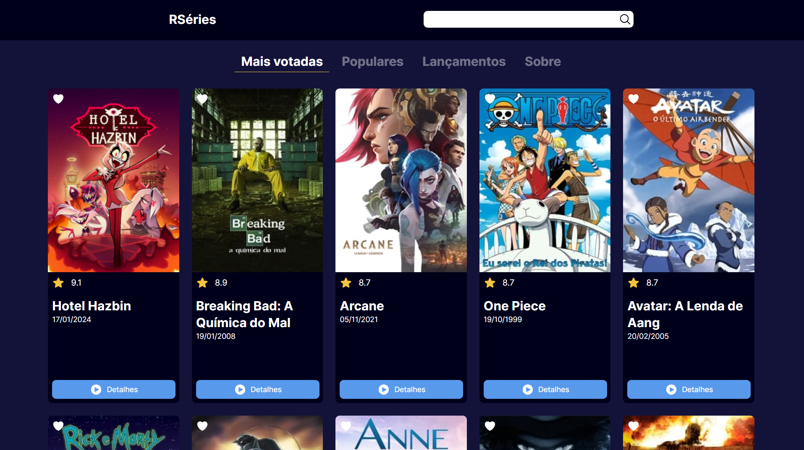

<h1 align="center">RSéries</h1>

Este é um projeto aberto. Confira a seguir informações relevantes sobre ele. 

  <a href="#-tecnologias">Tecnologias</a>&nbsp;&nbsp;&nbsp;|&nbsp;&nbsp;&nbsp;
  <a href="#-bibliotecas">Bibliotecas</a>&nbsp;&nbsp;&nbsp;|&nbsp;&nbsp;&nbsp;
  <a href="#-projeto">Projeto</a>&nbsp;&nbsp;&nbsp;|&nbsp;&nbsp;&nbsp;
  <a href="#-instruções">Instruções</a>&nbsp;&nbsp;&nbsp;|&nbsp;&nbsp;&nbsp;
  <a href="#memo-licença">Licença</a>

  

 

  

## 🚀 Tecnologias

Esse projeto foi desenvolvido com as seguintes tecnologias:

- React.js
- Typescript
- Next.js 14
- Tailwind css

## 📚 Bibliotecas

- Axios
- Shadcn

## 💻 Projeto

Essa é uma aplicação **React** em **Typescript** que traz diversas informações sobre séries de TV. O nome RSéries remete à sigla do meu nome: Rodrigo Serrasqueiro - R.S. Para acessar essas informações utilizei a API do [tmdb.org](https://www.themoviedb.org/). Nesse projeto usei Next na versão 14 com app router, Tailwind css e a biblioteca Shadcn que são as mais novas tecnologias do front-end. Totalmente responsiva, com design moderno e interativo, essa aplicação ainda pode melhorar muito. A ideia é construir uma API própria para possibilitar cadastro de usuários e também possibilitar que usuários postem comentários nas séries.

- [Acesse o projeto finalizado, online](https://rodrigoserrasqueiro.github.io/rseries)

## 📝 Instruções

### Pré-requisitos

Antes de começar, certifique-se de que possui as seguintes ferramentas instaladas em sua máquina:

1. Node.js
1. Git

### Clonando o repositório

Abra o terminal do seu sistema operacional e navegue até o diretório onde deseja clonar o repositório.

Digite o seguinte comando para clonar o repositório:

`git clone https://github.com/RodrigoSerrasqueiro/Rseries.git`

### Instalando as dependências

Navegue até a pasta do projeto no terminal.

Digite o seguinte comando para instalar as dependências do projeto:

`npm install`

### Executando o projeto

Na pasta do projeto, digite o seguinte comando para iniciar o servidor de desenvolvimento:

`npm start`

Abra o navegador e digite o seguinte endereço:

`http://localhost:3000`

Certifique-se de que a porta 3000 esteja livre em sua máquina.

## Conclusão:

Pronto! Agora você pode clonar e executar o projeto em sua máquina. Caso tenha alguma dúvida ou problema, sinta-se à vontade para abrir uma issue em nosso repositório.

## :memo: Licença

Esse projeto está sob a licença MIT.

---

Desenvolvido por: Rodrigo Serrasqueiro [Dê uma olhada no meu portfólio!](https://rodrigoserrasqueiro.github.io/Portfolio)
